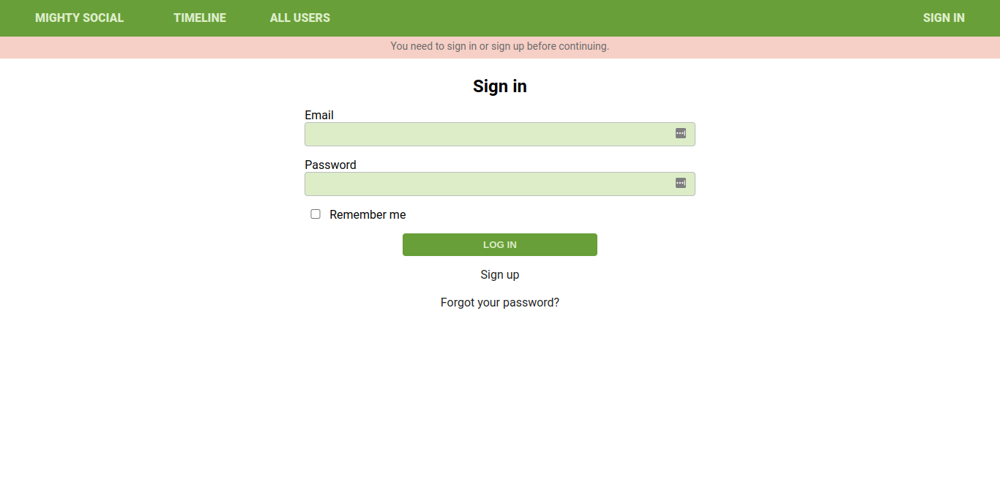

# Mighty Social

> The scope of this project was to build a mini social network similar to Twitter, which allows users to post and connect with each other.

The app has the following features:

- User can create account/log in
- Guest user can only visit the Sign In and Sign Up pages
- Logged-in user can see a list of the users on the app
- Logged-in user can view profiles of all users and their posts
- Logged-in user can create posts (text only) and get likes / dislikes, and also like posts from friends
- Logged-in user has a timeline where he/she can see ONLY posts from friends
- Logged-in user can add comments to posts
- Logged-in user can send a friendship invitation and also receive invitations from other friends
- Logged-in user can decide to Accept / Reject friendship invitations

## Built With

- Rails
- Ruby
- RSpec

## Live Demo

[Visit Mighty Social](https://mighty-social.herokuapp.com/)

## Getting Started

### Prerequisites

To get this project up and running locally, you must already have ruby and necessary gems installed on your computer

To get this project set up on your local machine, follow these simple steps:

1. Open Terminal
2. Clone the repository `git clone https://github.com/oracleot/ror-social-scaffold.git`
3. Move into project directory `cd ror-social-scaffold`
4. Install required gems `bundle install`
5. Create database `rails db:create`
6. Run database migration `rails db:migrate`
7. Start your server `rails server`
8. Run the app `http://localhost:3000`

### Testing

RSpec was used for testing and several test use cases have been created. To test, simply follow the instructions below:

1. Open Terminal
2. Make sure you are in the root directory, if not `cd ror-social-scaffold`
3. Run `rspec` in your terminal to run all tests
4. Alternatively, feel free to run each test separately by running `rspec spec/path_to_test` E.g `rspec spec/models/comment_spec.rb`
5. Watch all tests / specific tests pass

## Authors

👤 **Meron Ogbai**

- Github: [@meronokbay](https://github.com/meronokbay)
- Twitter: [@MeronDev](https://twitter.com/MeronDev)
- Linkedin: [linkedin](https://linkedin.com/in/meron-ogbai/)

👤 **Damilola Oduronbi**

- Github: [@oracleot](https://github.com/oracleot)
- Linkedin: [linkedin](https://linkedin.com/in/doduronbi/)

## 🤝 Contributing

Contributions, issues, and feature requests are welcome!

## Show your support

Give a ⭐️ if you like this project!

## 📝 License

This project is [MIT](lic.url) licensed.
